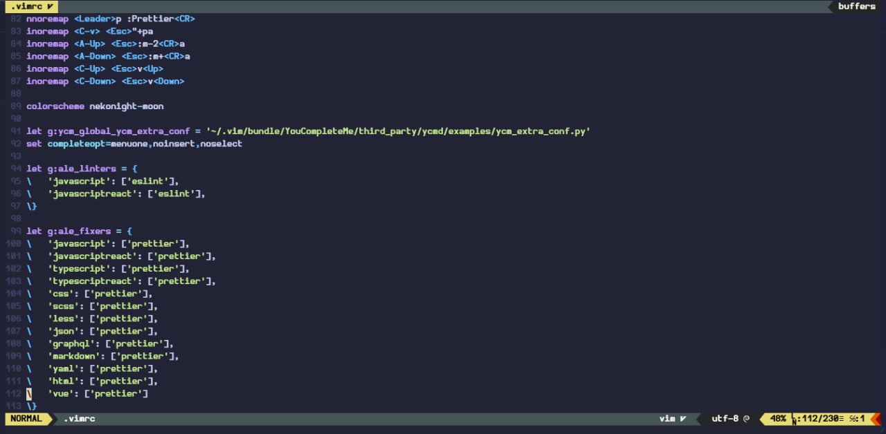
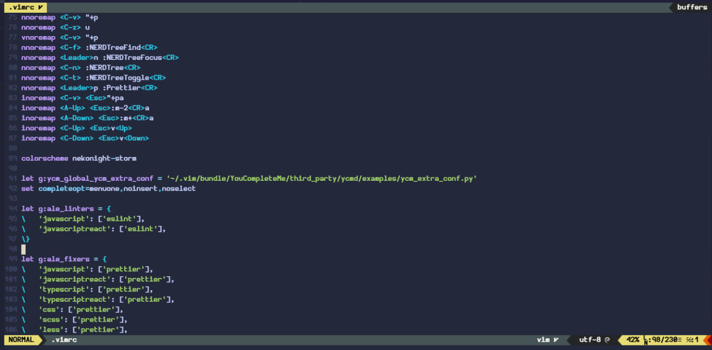
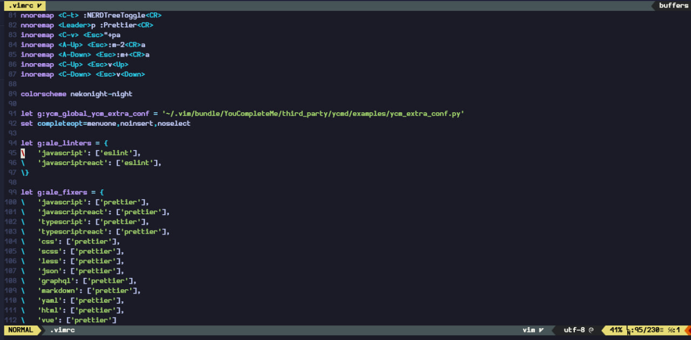
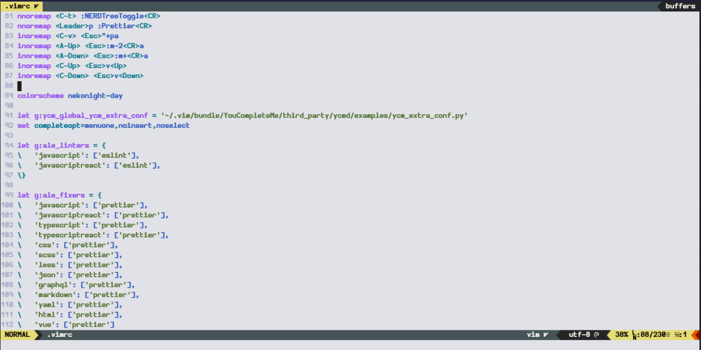

## vim ✨

Now we are in vim too

<table width="100%">
  <tr>
    <th>Moon</th>
    <th>Storm</th>
  </tr>
  <tr>
    <td width="50%">
      
    </td>
    <td width="50%">
      
    </td>
  </tr>
  <tr>
    <th>Night</th>
    <th>Day</th>
  </tr>
  <tr>
    <td width="50%">
      
    </td>
    <td width="50%">
      
    </td>
  </tr>
  <tr>
</table>

## Install

* Install with bundle 

```vim
Plugin 'neko-night/Vim'
```

* Install with vim-plug

```
Plug 'neko-night/Vim'
```